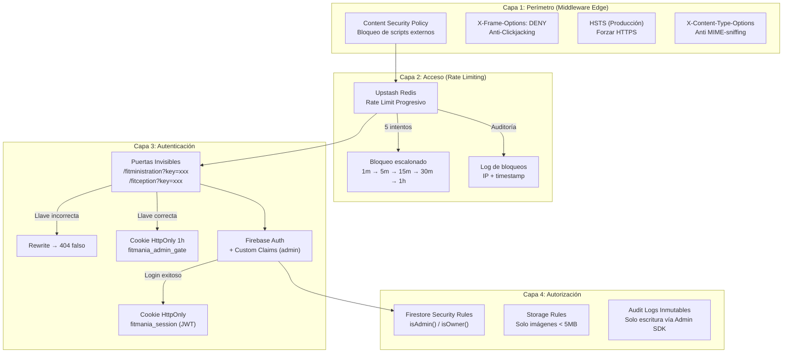
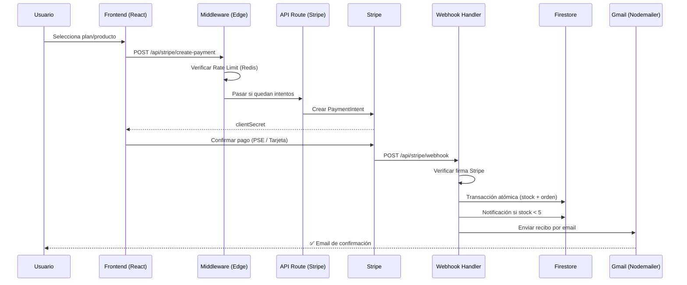
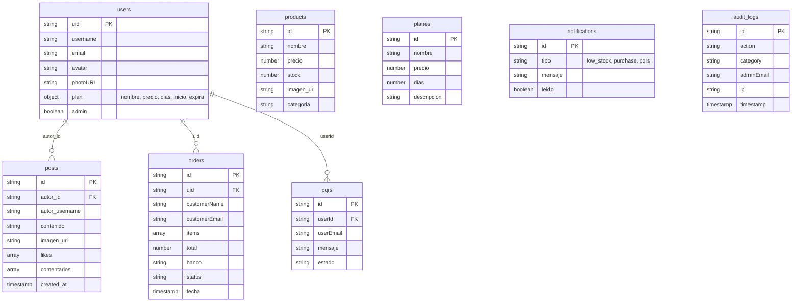

# 🦸‍♂️ FITMANIA — Arquitectura Completa de la Aplicación

> **Plataforma de gestión integral para gimnasio** con tienda online, pagos PSE/tarjeta, foro comunitario, paneles administrativos invisibles y sistema de seguridad multinivel.

---

## 🏗️ Stack Tecnológico Principal

| Categoría | Tecnología | Rol en la aplicación |
|---|---|---|
| **Lenguaje** | TypeScript | Tipado estricto en todo el proyecto (frontend + backend) |
| **Framework** | Next.js 16 (App Router + Turbopack) | SSR, API Routes, Middleware Edge, File-based routing |
| **Librería UI** | React 19 | Renderizado de interfaces con las últimas APIs (use, Server Components) |
| **Estilos** | Tailwind CSS 4 + tw-animate-css | Utility-first CSS con animaciones declarativas |
| **Componentes** | Radix UI (60 componentes) + Shadcn/ui | Sistema de diseño accesible y headless |
| **Hosting** | Vercel | Despliegue serverless con Edge Functions |

---

## 🔐 Seguridad — Arquitectura Multinivel



| Técnica | Tecnología | Detalle |
|---|---|---|
| **Rate Limiting Progresivo** | Upstash Redis | 5 intentos → bloqueo escalonado (1m, 5m, 15m, 30m, 45m, 1h) |
| **Puertas Invisibles** | Next.js Middleware | Rutas admin ocultas que devuelven 404 falso sin la llave |
| **Sesiones Seguras** | Cookies HttpOnly | No accesibles desde JavaScript (anti-XSS) |
| **Custom Claims** | Firebase Auth | Rol `admin` verificado server-side |
| **CSP** | Middleware Headers | Whitelist estricta: Stripe, Firebase, Cloudinary, Google Fonts |
| **Anti-Clickjacking** | X-Frame-Options: DENY | Bloquea embebido en iframes |
| **Anti-Sniffing** | X-Content-Type-Options | Previene ejecución de MIME incorrecto |
| **HSTS** | Strict-Transport-Security | HTTPS forzado por 1 año (producción) |
| **Auditoría Inmutable** | Firestore `audit_logs` | Solo Admin SDK escribe; frontend no puede borrar/editar |
| **Firestore Rules** | Security Rules declarativas | RBAC: `isAdmin()`, `isOwner()`, `isSignedIn()` |
| **Storage Rules** | Firebase Storage Rules | Solo imágenes, máximo 5MB, solo el dueño puede escribir |

---

## 💳 Pagos — Flujo Completo



| Componente | Tecnología | Detalle |
|---|---|---|
| **Procesador** | Stripe | PaymentIntents API con soporte PSE Colombia (15 bancos) |
| **Webhook** | API Route + firma | `stripe.webhooks.constructEvent()` verifica autenticidad |
| **Transacciones** | Firestore `runTransaction()` | Actualización atómica de stock + creación de orden |
| **Notificaciones** | Firestore `notifications` | Alerta automática de stock bajo (< 5 unidades) |
| **Emails transaccionales** | Nodemailer + Gmail | Pago exitoso, pago fallido, recibo detallado, respuesta PQRS |

---

## 📦 Estado Global y Datos

| Store | Tecnología | Datos gestionados |
|---|---|---|
| **useCartStore** | Zustand + `persist` | Carrito de compras (productos, cantidades, tallas, colores) |
| **useAuthStore** | Zustand + `persist` | Usuario autenticado, plan activo, avatar |
| **useUIStore** | Zustand | Menú móvil, dropdown de usuario |
| **Validaciones** | Zod | Esquemas de formularios (registro, login, PQRS) |
| **Formularios** | React Hook Form + @hookform/resolvers | Manejo de formularios con validación Zod integrada |

---

## 🗄️ Base de Datos — Colecciones Firestore



---

## ☁️ Servicios Externos (Free Tier)

| Servicio | Uso | Límite gratuito |
|---|---|---|
| **Firebase Auth** | Autenticación de usuarios + Custom Claims | 50k MAU |
| **Cloud Firestore** | Base de datos NoSQL en tiempo real | 1GB almacenamiento, 50k lecturas/día |
| **Firebase Storage** | Fotos de perfil y posts del foro | 5GB almacenamiento |
| **Cloudinary** | Imágenes de productos (tienda) | 25GB ancho de banda/mes |
| **Upstash Redis** | Rate limiting en Edge | 10k comandos/día |
| **Stripe** | Pagos PSE + tarjeta | Sin costo fijo, solo comisión por transacción |
| **Gmail (Nodemailer)** | Emails transaccionales | ~500 emails/día |
| **Vercel** | Hosting + Edge Functions + Analytics | 100GB bandwidth, Serverless functions |

---

## 🗂️ Estructura de Carpetas

```
fitmania/
├── app/                          # App Router (Next.js)
│   ├── api/                      # API Routes (Backend)
│   │   ├── admin/                # 11 endpoints CRUD admin
│   │   │   ├── archive-sales/    #   Corte de caja mensual
│   │   │   ├── login/            #   Login con Firebase Admin SDK
│   │   │   ├── logout/           #   Borrar cookie de sesión
│   │   │   ├── logs/             #   Auditoría inmutable
│   │   │   ├── notifications/    #   Alertas de stock/compras
│   │   │   ├── orders/           #   Gestión de ventas
│   │   │   ├── planes/           #   CRUD de suscripciones
│   │   │   ├── pqrs/             #   Sistema de soporte
│   │   │   ├── products/         #   CRUD de inventario
│   │   │   ├── stats/            #   Dashboard estadísticas
│   │   │   └── users/            #   Gestión de socios
│   │   ├── auth/verify/          # Verificación de sesión JWT
│   │   ├── recepcion/            # Login/Logout recepción
│   │   ├── security/             # Rate limit check + log-block
│   │   ├── send-email/           # Envío de correos
│   │   └── stripe/               # create-payment + webhook
│   ├── carrito/                  # Página del carrito
│   ├── context/                  # AuthContext (Firebase listener)
│   ├── entrenadores/             # Página de entrenadores
│   ├── fitception/               # 🔒 Panel de Recepción (invisible)
│   ├── fitministration/          # 🔒 Panel de Admin (invisible)
│   ├── foro/                     # Foro comunitario
│   ├── login/                    # Login de usuarios
│   ├── pago/                     # Flujo de pago Stripe
│   ├── perfil/                   # Perfil de usuario
│   ├── planes/                   # Catálogo de membresías
│   ├── pqrs/                     # Formulario de soporte
│   ├── registro/                 # Registro de usuarios
│   ├── tienda/                   # E-commerce de productos
│   ├── globals.css               # Estilos globales
│   ├── layout.tsx                # Layout raíz (fuentes + Auth)
│   └── page.tsx                  # Landing page
├── components/
│   ├── admin/                    # Componentes del panel admin
│   ├── home/                     # Componentes de la landing
│   ├── layout/                   # Navbar, Footer
│   ├── recepcion/                # Componentes de recepción
│   └── ui/                       # 60 componentes Shadcn/Radix
├── hooks/                        # use-mobile, use-toast
├── lib/
│   ├── audit-logger.ts           # Logger inmutable (Firestore)
│   ├── auth-helpers.ts           # Helpers de autenticación
│   ├── avatar-utils.ts           # Utilidades de avatar
│   ├── firebase-admin.ts         # Admin SDK (lazy init + B64 key)
│   ├── firebase.ts               # Client SDK (Auth, DB, Storage)
│   ├── rate-limit-client.ts      # Cliente frontend del rate limiter
│   ├── store.ts                  # Zustand stores (Cart, Auth, UI)
│   └── utils.ts                  # cn() utility (clsx + tailwind-merge)
├── services/
│   ├── cloudinary.ts             # Upload de imágenes
│   └── mail.ts                   # 4 plantillas HTML de email
├── middleware.ts                 # 🛡️ Firewall de aplicación
├── firestore.rules               # Reglas de seguridad Firestore
└── storage.rules                 # Reglas de seguridad Storage
```

---

## 🎨 Diseño y Tipografía

| Elemento | Fuente | Variable CSS |
|---|---|---|
| **Display (títulos héroes)** | Bangers | `--font-display` |
| **Headings** | Epilogue | `--font-heading` |
| **Body text** | Plus Jakarta Sans | `--font-body` |
| **Labels / UI** | Space Grotesk | `--font-label` |

**Estética:** Temática de cómics/superhéroes con bordes gruesos, sombras duras (`shadow-[Xpx_Xpx_0_0]`), colores vibrantes (rojo #DC2626, negro, amarillo), y animaciones de hover "pop".

---

## 📊 Librerías Adicionales

| Librería | Uso |
|---|---|
| **Recharts** | Gráficos en el dashboard admin |
| **jsPDF + jspdf-autotable** | Exportación de reportes a PDF |
| **date-fns** | Formateo de fechas |
| **Embla Carousel** | Carruseles de productos/planes |
| **Sonner** | Notificaciones toast |
| **Lucide React** | Iconografía consistente |
| **react-qr-code / react-qr-scanner** | Generación y lectura de códigos QR |
| **Vaul** | Drawers móviles |
| **Vercel Analytics** | Métricas de uso en producción |
